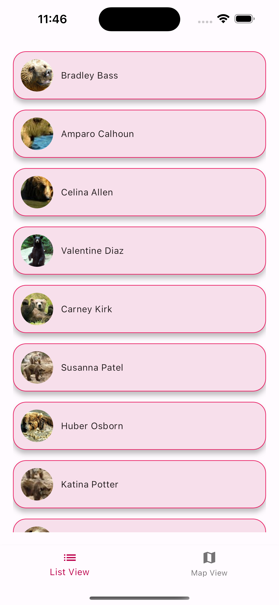
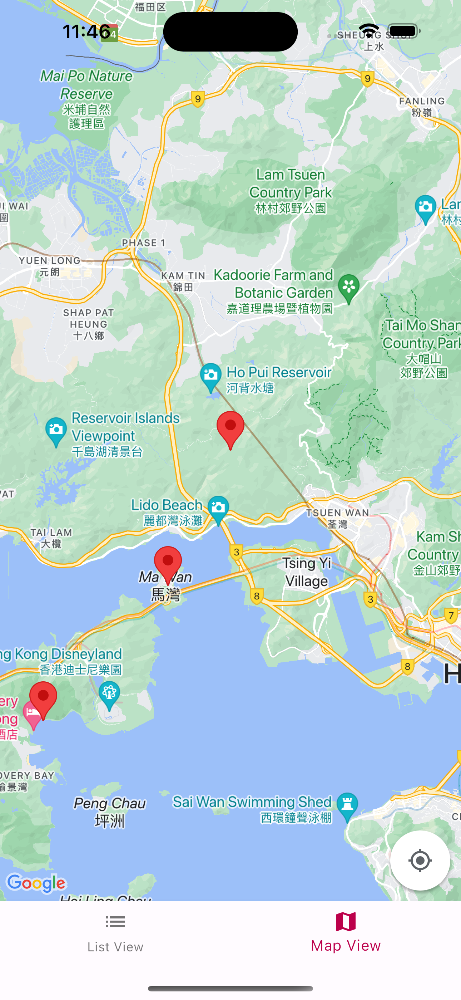
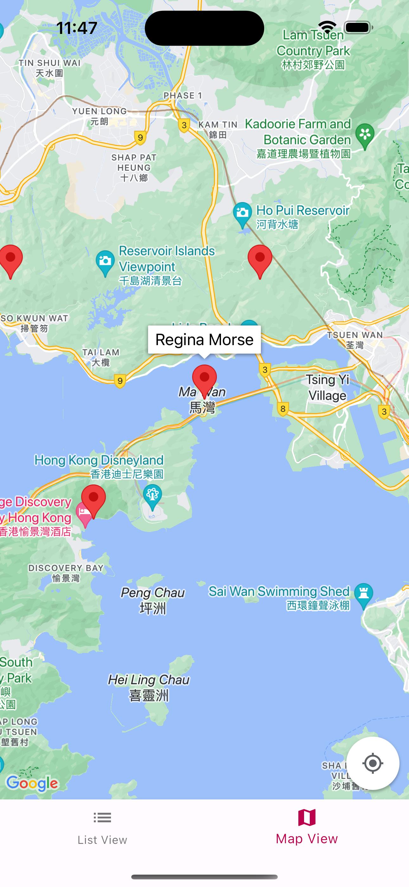
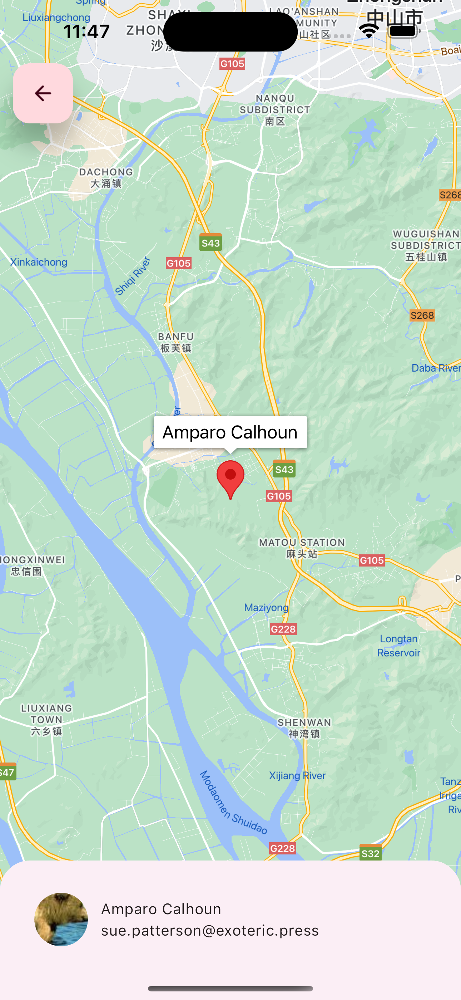

# People In ListMap

Flutter project of Mobile Developer Programming Test.

## Env Info
- Flutter sdk version: >=3.2.5 <4.0.0
- App version: 1.0.0

## Getting Started

- Install development tool(optional) -> dart script manager [rps](https://pub.dev/packages/rps).

- Install project.
    ```bash
    rps install
    # Without rps
    flutter pub get
    ```
- Run project.
    ```bash
    rps run
    # Without rps
    flutter run
    ```
    ```bash
    # Run in profile
    rps profile
    # Without rps
    flutter run --profile
    ```
- Run Test.
    ```bash
    rps test
    # Without rps
    flutter test
    ```
- Build project(iOS).
    ```bash
    rps build-release-ios
    # Without rps
    flutter build ipa --release
    ```
- Build project(Android).
    ```bash
    # Build apk
    rps baa
    # Without rps
    flutter build --release apk --flavor production
    ```
    ```bash
    # Build app bundle
    rps bab
    # Without rps
    flutter build --release appbundle --flavor production
    ```
- Clean project.
    ```bash
    rps cache-clean
    # Without rps
    pub cache repair && flutter pub cache repair
    ```
- More rps command refer to pubspec.yaml.

## Screenshots

### Home Page (List View)


### Home Page (Map View)



### Detail Page


